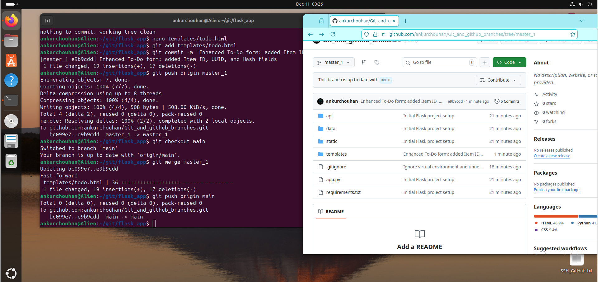
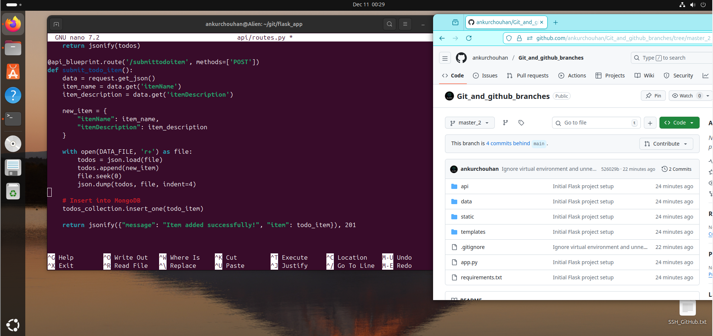

<!-- HEADER -->

  

<h1 align="center">🧠 Git & GitHub Branches — Flask To-Do Application</h1>

  <b>Master Git branching, merging, rebasing, and conflict resolution using a Flask-based To-Do web app.</b>

  👤 Author: <a href="https://github.com/ankurchouhan"><b>Ankur Chouhan</b></a> 
  🗂 Repository: <a href="https://github.com/ankurchouhan/Git_and_github_branches"><b>Git_and_github_branches</b></a>

---

## 🚀 Project Overview

This project demonstrates **real-world Git collaboration workflows** using a **Flask To-Do Application**.  
It simulates a professional development setup with **multiple branches**, **merges**, **rebasing**, and **conflict resolution**.

### 🎯 You’ll Learn:
- 🌿 Creating and managing Git branches  
- 🧩 Merging and rebasing branches  
- ⚔️ Resolving merge conflicts  
- ☁️ Pushing code to GitHub  
- 🧹 Cleaning up merged branches  
- 💡 Visualizing Git graphs and history  

---

## ⚙️ Git Workflow Demonstration (Step-by-Step with Screenshots)

> Below are some key screenshots demonstrating branch operations and merge resolutions:

   
   
   
  

---

## 🧠 Git Commands Summary

| Action | Command |
|--------|----------|
| Initialize Repo | `git init` |
| Create Branch | `git checkout -b <branch-name>` |
| Switch Branch | `git checkout <branch-name>` |
| Merge Branch | `git merge <branch-name>` |
| Rebase Branch | `git rebase <branch-name>` |
| View Branches | `git branch -a` |
| Push to GitHub | `git push origin <branch-name>` |
| Delete Local Branch | `git branch -d <branch-name>` |
| Delete Remote Branch | `git push origin --delete <branch-name>` |
| Visualize Commits | `git log --oneline --graph --decorate --all` |

---

## 🌳 Branch Naming Convention

| Type | Prefix | Example |
|------|---------|----------|
| Main Branch | `main` | `main` |
| Development Branch | `dev` | `dev` |
| API Branch | `apis` | `apis` |
| Frontend Feature Branch | `master_1` | `master_1` |
| Backend Feature Branch | `master_2` | `master_2` |

---

## 💡 CI/ CD Deployments for Team Collabs

By completing this project, you’ll master:

- ✅ Branch creation & version isolation  
- ✅ Rebasing for a clean commit history  
- ✅ Handling and resolving merge conflicts  
- ✅ Managing multiple branches effectively  
- ✅ Cleaning up old branches  
- ✅ Visualizing Git structure with graphs  

---

## 🧰 Tech Stack

| Component | Technology |
|------------|-------------|
| 🐍 Backend | Flask (Python) |
| 💾 Database | MongoDB / JSON / SQLite |
| 💅 Frontend | HTML, CSS |
| ⚙️ Version Control | Git & GitHub |
| 💻 Environment | Ubuntu + VS Code |

---

  ⭐ <b>If you found this project helpful, please star the repository!</b> ⭐  
    
  Built with ❤️ by <a href="https://github.com/ankurchouhan">Ankur Chouhan</a> • 2025

