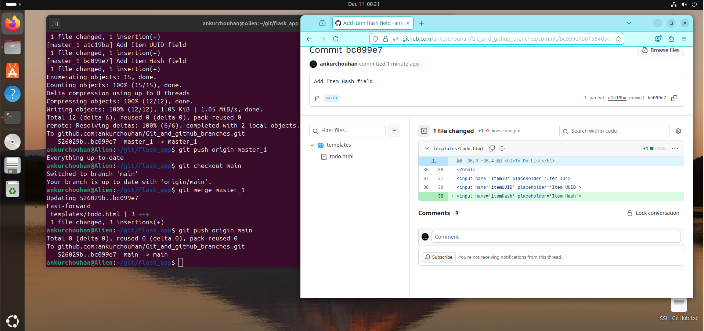
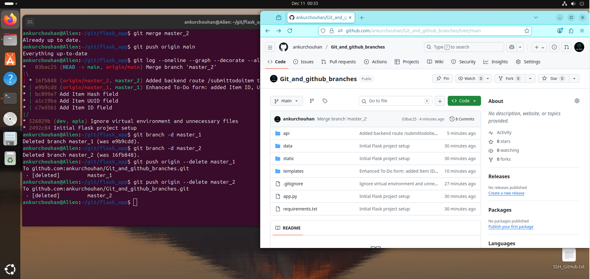
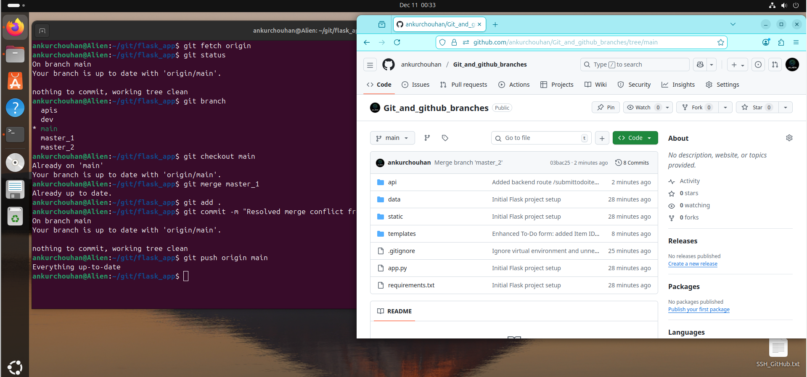

<!-- HEADER -->

  

<h1 align="center">🧠 Git & GitHub Branches — Flask To-Do Application</h1>

  <b>Learn Git branching, merging, rebasing, and conflict resolution using a Flask-based To-Do web app.</b>

  👤 Author: <a href="https://github.com/ankurchouhan"><b>Ankur Chouhan</b></a>  
   
  🗂 Repository: <a href="https://github.com/ankurchouhan/Git_and_github_branches">Git_and_github_branches</a>

---

## 🚀 Project Overview

This project demonstrates **Git workflow mastery** using a **Flask To-Do Application**.  
It shows real-world collaboration techniques — how developers use **branches, merges, rebasing, and conflict resolution** effectively.

### 🎯 Covers:
- 🌿 Creating and managing Git branches  
- 🔀 Merging multiple branches  
- ⚔️ Resolving merge conflicts  
- 🔄 Rebasing for clean commit history  
- ☁️ Pushing changes to GitHub  
- 🧹 Deleting branches locally and remotely  

---

## ⚙️ Git Workflow Demonstration (with Screenshots)

### 🪜 Step 1 — Push Existing Flask Project to New GitHub Repo (main)

---

### 🌿 Step 2 — Create `dev` Branch and Commit Flask Project Files

---

### 🌿 Step 3 — Merge `dev` into `main` and Prepare for API Work
> Merge `dev` → `main`, then create a new branch for API work.

---

### 🌿 Step 4 — Create `apis`, Commit JSON Data, Merge Back into `main` & Create `master_1` / `master_2`
> Work in `apis` branch, then merge it into `main`. After that, create `master_1` and `master_2` branches for separate features.

---

### ☁️ Step 5 — List All Branches and Push `master_1` to GitHub

---

### 📝 Step 6 — Edit To-Do Form in `master_1` (HTML Changes)
> Update `templates/todo.html` in `master_1` to add more fields to the To-Do form.

---

### 🔄 Step 7 — Rebase `master_1` on Top of Latest `main`
> Bring `master_1` up to date with `main` using `git rebase main`.

---

### 🔀 Step 8 — Commit Enhanced Form in `master_1` and Merge into `main`
> Commit updated form in `master_1`, push it, then merge into `main` and push again.

---

### 💻 Step 9 — Update Backend Route in `master_2` (API Logic)
> Edit `api/routes.py` in `master_2` to enhance the backend `/submittodoitem` route.

---

### 🔀 Step 10 — Merge `master_2` into `main` and Push Final Changes
> Push `master_2`, then merge it into `main` and push to GitHub.

---

## 🔍 Extra Visuals — Git Branch Graphs

### 🌳 Git Graph — Branch Overview

### 🌳 Git Graph — `master_1` and `master_2` Merged into `main`

### ⚔️ Git Graph — Merge Conflicts While Merging `master_1`

---

## 🧠 Git Commands Summary

| Action | Command |
|--------|----------|
| Create Branch | `git checkout -b branch-name` |
| Switch Branch | `git checkout branch-name` |
| Merge Branch | `git merge branch-name` |
| Rebase Branch | `git rebase branch-name` |
| Delete Local Branch | `git branch -d branch-name` |
| Delete Remote Branch | `git push origin --delete branch-name` |
| View Branches | `git branch -a` |

---

## 🌳 Branch Naming Convention

| Type | Prefix | Example |
|------|--------|---------|
| Main Branch | `main` | `main` |
| Feature Branch | `feature/` | `feature/add-task` |
| Fix Branch | `fix/` | `fix/typo-bug` |
| Docs Branch | `docs/` | `docs/update-readme` |
| Experimental | `exp/` | `exp/test-api` |

---

## 💡 Learning Outcomes

By following this project, you’ll learn:
- ✅ Branch creation & management  
- ✅ Merge conflict resolution  
- ✅ Rebasing workflow  
- ✅ Clean commit practices  
- ✅ Collaborative GitHub flow  

---

## 🧰 Tech Stack

| Component | Technology |
|------------|-------------|
| 🐍 Backend | Flask (Python) |
| 💾 Database | SQLite |
| 💅 Frontend | HTML, CSS |
| ⚙️ Version Control | Git & GitHub |
| 🧩 Editor | VS Code |

---

## 📜 License

This project is open source under the **MIT License**.

---

  ⭐ <b>If you found this project helpful, please star the repository!</b> ⭐  
   
  Built with ❤️ by <a href="https://github.com/ankurchouhan">Ankur Chouhan</a> • 2025

